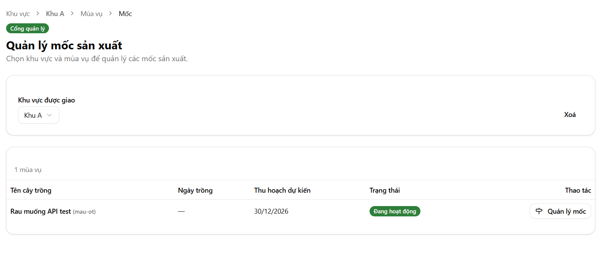
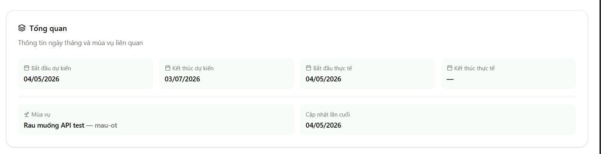

Giờ chúng ta cần migrate lại các sidebar và manager như sau

đầu tiên việc config milestone chỉ xuất hiện trong plan có status là planning và reject

nên page này ko cần thiết, và sidebar này là ko cần thiết

tiếp đến đi đến flow page cropseason

trong đây sẽ chia nhỏ ra sidebar nhỏ là
+history cropseason

- now cropseason
  dù là 1 trong tab này bắt buộc phải hiển thị card này
  
  trong now cropseason thì sẽ phân ra như sau
  nếu là planning hoặc reject thì sẽ có hiển
  thị tab là list milestone và list request đã được send
  trong đây sẽ hiển thị ra list milestone
  vô từng click milestone sẽ là từng config chi tiết của milestone(nếu đã config), nếu chưa thì hiển thị bắt user config milestone
  nếu crop season đã active hoặc được duyệt
  thì sẽ hiển thị 4 tab (tổng quan cảm biến(phần này sẽ hiển thị ra các thông tin như các thiết bị iot và sensor và thông số cảm biến gửi về), nhiệm vụ hàng ngày của nông dân, list gửi request và cuối cùng là harvest record)
  hãy tìm template mẫu best practice ui cho phần rồi implement vô
